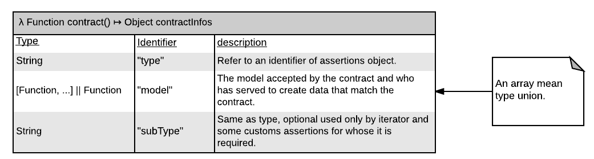

# js-contract-on-value
Library for create contract on the type value of a data.

First class support about type union and iterator.

## Example:
```javascript
const a = new String('Hello world!');
const b = 'Hello world!';
const c = 15;
const ctString = contract('primitive', String);
// No error
{
	if ((contract.validataBool(a, ctString) === false) ||,
	(contract.validataBool(c, ctString) === false))
		throw new Error('a && b shall be a String!');
}
// Throw error
{
	contract.validate(c, ctString, new TypeError('c shall be a String!'));
}
// Create a contract who expect data has Symbol.iterator property and values are wheter Number || Boolean || String
{
	contract('iterator', [Number, Boolean, String], 'primitive');
}
```

## Important objects:
|                                                                 |                                                                 |
|-----------------------------------------------------------------|-----------------------------------------------------------------|
|      | Export of this library is `contract` function.<br>There are three type of contract called as assertion and stored at `assertions` object.<br>`contract` is used to create a new object representating the contract.<br>`validate` and `validateBool` validate a contract in function of a data.<br> All functions are pure.

## Choose an assertion:
### Primitive
Used to match primitive data type.<br>
Correct if data is an instance of model or an primitive of this.<br>
Function composing the model shall be an identifier of object `primitives`

## Creating a contract:


## Validating a contract: